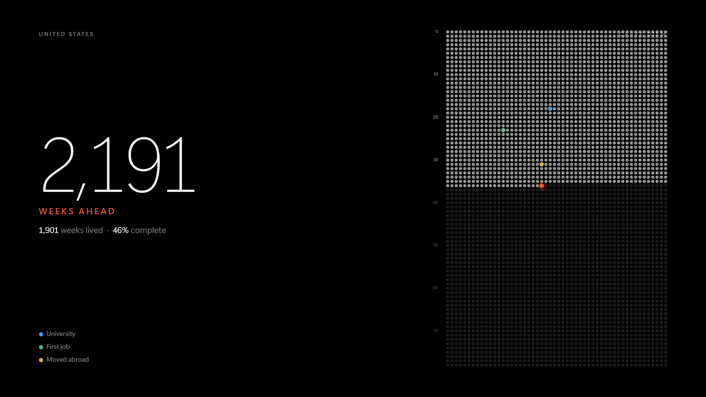
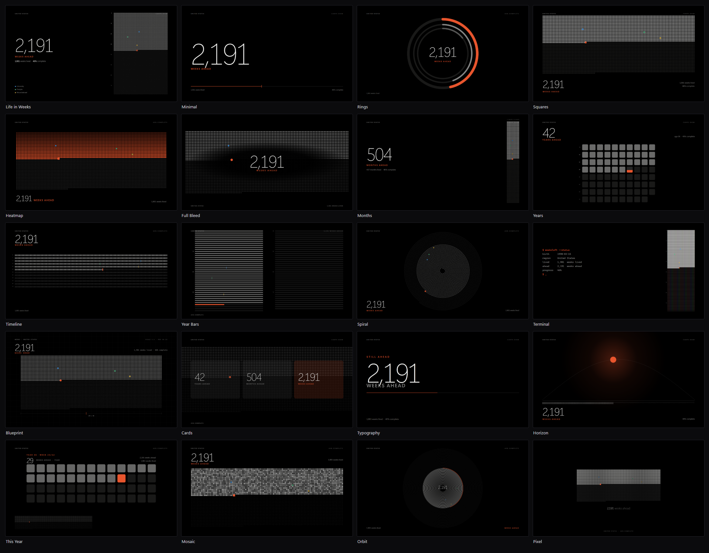
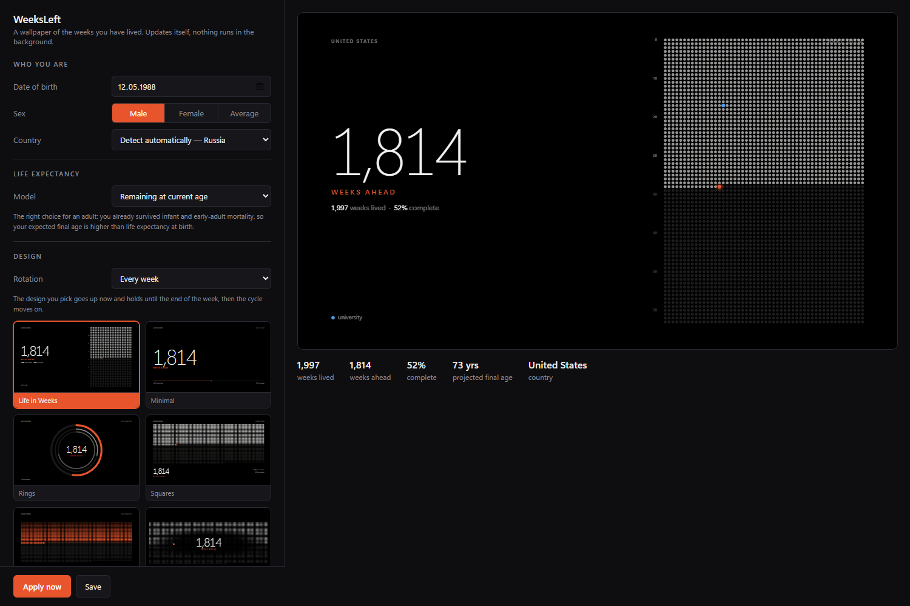

<div align="center">

# WeeksLeft

**A Windows wallpaper of the weeks you have lived — and the ones still ahead.**

Twenty designs. 4K and every other resolution. Redraws itself once a week.
No process running in the background, ever.

[Русская версия](README.ru.md)



</div>

---

## What it does

Give it your date of birth. It works out your country from Windows, looks up the mortality
data for someone your age and sex, and renders a wallpaper: every week you have lived as a
filled dot, every week still ahead as an empty one, this week glowing in your accent colour.

Each week the picture redraws itself with one more dot filled in.

The framing is deliberately forward-looking: the headline number is **weeks ahead**, not
weeks left. There is a neutral mode if you prefer the countdown.

## Why it costs nothing to run

There is no resident process. A per-user scheduled task fires on logon, on session unlock,
and once a day. Each run compares the current state — week number, theme, accent colour,
design, monitor layout — against what was applied last time. If nothing changed it exits in
about 30 ms without rendering anything.

| | |
|---|---|
| Idle | **0 MB, 0% CPU** — nothing is running |
| "Nothing changed" check | ~30 ms, then it exits |
| Full 4K render | ~1.2 s, ~200 MB peak, once a week |
| Download | 2.3 MB |

## Install

Grab the zip from [Releases](../../releases), unzip it anywhere, and run `WeeksLeft.exe`.
Set your date of birth, pick a design, press **Install to system**.

That copies the app to `%LOCALAPPDATA%\Programs\WeeksLeft`, adds a Start menu shortcut,
registers the scheduled task, and lists itself in **Apps & features** so it uninstalls the
normal way. Everything lives inside your user profile — no administrator rights, nothing
written to Program Files or HKLM.

Requires Windows 10/11 and the [.NET 8 Desktop Runtime](https://dotnet.microsoft.com/download/dotnet/8.0).
WebView2 is already on every current Windows install.

Building from source:

```powershell
dotnet publish src\WeeksLeft\WeeksLeft.csproj -c Release -o dist
```

## Twenty designs



By default the design changes every week, so the wallpaper stays interesting on its own.
Pick one in the gallery and it goes up immediately and holds until the end of the week;
set rotation to *Fixed* and it stays until you change it.

Designs are plain HTML files in `assets/templates`. Adding a twenty-first is one file.

## Settings



The settings window is itself an HTML page in WebView2 — the same engine that renders the
wallpaper — so the gallery shows the real designs live rather than screenshots, and the
preview on the right is a true reduction of what will land on your desktop, at your
monitor's aspect ratio.

Country is detected from the Windows **Home location** setting. No geolocation, no IP
lookup, no network access at all — the mortality data ships inside the binary.

Also in there: theme (dark, light, or follow Windows), accent colour (yours or the Windows
one), units (weeks, months, days, years), wallpaper language (English or Russian), safe
margins so the composition dodges your desktop icons and the taskbar, an optional custom
line of text, per-monitor behaviour, and **life milestones** — your own dated events
plotted as coloured dots on the week grid.

Settings save themselves as you type; closing the window never loses anything.

## About the statistics

Life expectancy **at birth** is the wrong number for an adult, and most "life in weeks"
tools get this wrong. It averages in infant and early-adult mortality that you have already
survived, so it understates how long you can expect to live — badly, in countries where
that early mortality is high.

WeeksLeft defaults to **remaining life expectancy e(x) at your current age**. It derives a
full life table from your country and sex using a Brass relational logit model: it solves
for the α that makes a standard life table reproduce your country's e₀, then reads e(x) off
the result. All offline, about 50 KB of embedded data.

The difference is not academic. A 38-year-old Russian man has an e₀ of 68 years, but a
projected final age of roughly 73 — five years that the naive calculation simply deletes.

Three models are available: **remaining at current age** (the default), **at birth** (the
classic headline figure), and a **custom target age**, plus a manual override. The projected
end year is shown only if you ask for it; it is off by default, because plenty of people
would rather not see that date every morning.

Figures are approximate UN WPP 2024 / WHO GHO era estimates for about 170 countries,
rounded to 0.1 years, in [`LifeData.cs`](src/WeeksLeft/LifeData.cs).

## Command line

| Flag | Effect |
|---|---|
| *(none)* | settings window |
| `--apply` | refresh the wallpaper if anything changed — this is what the scheduler runs |
| `--apply --force` | re-render unconditionally |
| `--dry-run` | render the PNGs but leave the desktop alone |
| `--install` / `--uninstall` | install to or remove from the system (`--quiet` skips dialogs) |
| `--install-task` / `--uninstall-task` | manage only the scheduled task |
| `--shoot <file.html> <w> <h> <out.png>` | render any local page — for working on designs |

Config and logs live in `%LOCALAPPDATA%\WeeksLeft\`. It is a WinExe, so PowerShell neither
waits for it nor sees its exit code; use `Start-Process ... -Wait` when scripting.

## Writing your own design

Drop an HTML file into `assets/templates` and it appears in the gallery. Define `render(d)`
and call `WL.boot(render)`:

```html
<link rel="stylesheet" href="base.css">
<canvas id="c"></canvas><div id="ui"></div>
<script src="lib.js"></script>
<script>
function render(d) {
  var p = WL.palette(d), T = WL.t(d.lang), b = WL.box(d), c = WL.counts(d);
  var g = WL.canvas(b, p);                       // canvas, already filled with the background

  var gm = WL.wrapGeom(d, b, { gap: 0.3 });      // picks 52 / 104 / 156 ... columns
  var ox = b.left + (b.w - gm.w) / 2, oy = b.top + (b.h - gm.h) / 2;
  WL.eachWeek(d, gm, ox, oy, function (x, y, i) {
    WL.dot(g, x, y, gm.cell, i.state === 'past' ? p.dim(0.6)
                           : i.state === 'now'  ? p.accent : p.dim(0.12));
  });

  var add = WL.layer();                          // absolutely positioned text layer
  WL.header(add, d, p, b);
  add(WL.fmt(c.left, d.lang) + ' ' + T[c.kLeft], {
    cls: 'big nw', left: b.left + 'px', bottom: b.bottom + 'px',
    fontSize: (90 * b.u) + 'px', color: p.fg
  });
}
WL.boot(render);
</script>
```

The viewport is the exact wallpaper size in pixels, so you can lay out directly in px —
`WL.box` hands you the safe area and a scale factor `u` that is 1.0 at 1920×1080.

The useful bits of `lib.js`: `WL.geom` for a fixed 52-per-row grid, `WL.wrapGeom` to let the
column count follow the screen shape, `WL.eachCell` / `WL.eachWeek` to walk the cells,
`WL.dot` / `WL.square` for marks, `WL.palette` for a contrast-checked accent, `WL.counts`
for numbers that respect the unit and tone settings.

Add a display name to `manifest.json`, and debug with
`WeeksLeft.exe --shoot assets\templates\mine.html 3840 2160 out.png`.
Opening `assets/settings.html?demo=en` in a browser runs the whole settings UI standalone.

## Details that turned out to matter

* **A 52 × 75 grid never fills a 16:9 screen.** Height binds first and the block ends up a
  narrow column. `WL.wrapGeom` wraps the weeks onto rows of 52, 104, 156 … and keeps the
  layout that covers the most of the frame, so a column still means the same time of year.
* **Windows re-encodes wallpapers as ~85% JPEG**, which wrecks 4K gradients. The app sets
  `HKCU\Control Panel\Desktop\JPEGImportQuality = 100`.
* **Windows caches wallpapers by file path**, so the PNG filename carries a state hash.
* **Physical monitor size comes from `IDesktopWallpaper.GetMonitorRECT`**, not WinForms —
  at 125% scaling `Screen.Bounds` reports 3072×1728 instead of the real 3840×2160, and the
  wallpaper would come out soft.
* **The dark theme is pure black** `#000000`, so OLED panels switch those pixels off.
* **Never serve local UI from a virtual `https://` host** in WebView2 if you care about
  startup: it cost 1.5 s per launch here versus a plain `file://` URL. A `.local` hostname
  costs another 400 ms on top, because the TLD triggers an mDNS lookup.

## Not done yet

Lock screen wallpaper (different API), and the e₀ table is hand-entered rather than pulled
from UN WPP automatically.

## License

MIT — see [LICENSE](LICENSE).
